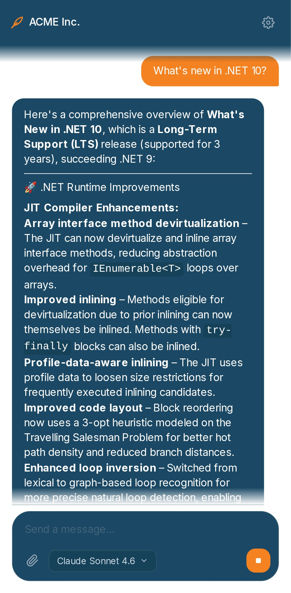
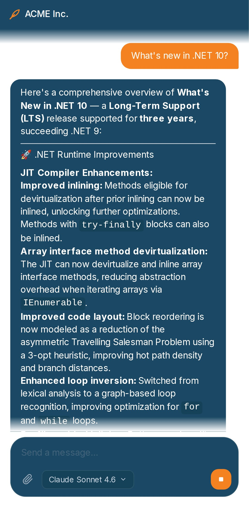

# Quill

[](https://github.com/cordfuse/quill/releases)
[](LICENSE)

<table>
  <tr>
    <td align="center"><sub>Welcome + starter prompts</sub><br></td>
    <td align="center"><sub>Streaming chat response</sub><br></td>
  </tr>
  <tr>
    <td align="center"><sub>Conversation history</sub><br></td>
    <td align="center"><sub>Settings panel</sub><br></td>
  </tr>
</table>

<table>
  <tr>
    <td align="center"><sub>Kiosk mode — gear visible</sub><br></td>
    <td align="center"><sub>Full kiosk — gear also hidden</sub><br></td>
  </tr>
</table>

<p align="center"><sub><b>The same app in two kiosk configs</b> — rebranded as "ACME Inc.", custom theme, history sidebar / web search / MCP picker hidden. Right variant adds <code>QUILL_SHOW_SETTINGS=0</code> to drop the gear too. Note the live <code>.NET 10</code> answer in both — web search runs transparently server-side even with no globe toggle.</sub></p>

Embeddable AI chatbot framework. Drop-in branding, kiosk-friendly, MCP-ready.

## The problem

OSS chat starters split into two camps. **Full-fat platforms** (Open WebUI, LibreChat) are feature-rich but built around "I run my own AI workbench" — hard to embed in a customer-facing site, hard to lock the UI down for a support widget, hard to rebrand without forking and maintaining a soft fork forever. **Minimal starters** (the Vercel chatbot template) are easy to clone, but every polish detail — multi-provider, MCP, attachments, streaming-that-survives-mobile, brand-it-yourself config, kiosk lockdown — is on you to build.

The middle ground — *"a polished chatbot I can drop into my site, white-label, and self-host in a container"* — doesn't really exist in OSS. It's either build-it-yourself or pay for SaaS (Intercom, Crisp, Tidio) that owns your branding and your conversations.

## The solution

Quill: one Docker image + one mounted config volume. Set env vars for an LLM provider and a JWT secret, edit one JSON file to rebrand, and you have a branded chatbot running on your domain. To lock it down for an embed or public kiosk deployment, flip a handful of `QUILL_SHOW_*` env flags — the matching UI controls disappear and the features keep running transparently server-side.

A single Next.js app, no database, no signup. Point it at any of 12 LLM providers, mount a config volume of icons/themes/MCP servers, and ship.

## Features

- **Multi-provider via [`token.js`](https://www.npmjs.com/package/token.js)** — 9 cloud (Anthropic, OpenAI, Gemini, Groq, Mistral, Cohere, Perplexity, AWS Bedrock, AI21) + 3 local OpenAI-compatible (Ollama, llama.cpp, LM Studio). Switch with one env var.
- **MCP support** — add any number of MCP servers (HTTP or stdio) via `config/quill-mcp.json`. Tools are namespaced and auto-discovered.
- **Web search** — Tavily integration with a composer toggle. Hide the toggle to make search always-on.
- **Resumable streams** — server keeps a 5-minute replay buffer; clients reconnect via `Last-Event-ID` after dropped sockets (mobile-tab background, proxy hiccup, network blip). No lost tokens.
- **Kiosk mode** — six env flags to lock down the UI surface: settings panel, chat history, web search, MCP picker, model picker, attachments. Hidden controls still run server-side using whatever's configured.
- **Drop-in branding** — edit `config/quill.config.json` (app name, welcome message, starter prompts, theme colors, favicon, PWA icons). Next page request picks up the change. No rebuild.
- **25 built-in themes + custom themes** — 13 dark + 12 light shipped; add your own under `themes[]` in the config.
- **Document + image attachments** — PDF, DOCX, XLSX, plain text, images. Extracted server-side.
- **PWA-ready** — manifest, installable, runs offline at the shell level.
- **No database** — conversations persist in browser `localStorage` (unless kiosk mode disables persistence).

## Quick start (Docker)

```bash
cd docker/
cp .env.example .env
# Edit .env — at minimum set JWT_SECRET and one provider API key
docker compose up --build
# → http://localhost:3008
```

The container reads its branding, themes, MCP server list, and icons from a host-mounted volume (default: `../nodejs/config`). Edit any file in that dir and the next page load reflects the change.

For a Caddy-fronted TLS deployment: `docker compose -f docker-compose.prod.yml up -d --build` (edit `Caddyfile` first to set your domain).

For a deployment behind an existing host-level reverse proxy: `docker compose -f docker-compose.internal-caddy.yml up -d --build` (compose joins the external `proxy_net` network; the app exposes no host port).

## Quick start (bare-metal Node)

```bash
cd nodejs/
npm install
cp .env.example .env.local
# Edit .env.local — at minimum set JWT_SECRET and one provider API key
npm run dev
# → http://localhost:3000
```

## Configuration

All operator config lives in two places:

- **Secrets + flags** → env vars (Docker `.env` or bare-metal `.env.local`)
- **Branding + themes + MCP servers + icons** → `nodejs/config/` (the persistent volume mount in Docker setups)

### Provider API keys

Set the env var for the provider you want, plus `QUILL_PROVIDER` to select it.

| Provider | Env var(s) | Category |
|---|---|---|
| Anthropic | `ANTHROPIC_API_KEY` | cloud |
| OpenAI | `OPENAI_API_KEY` | cloud |
| Google Gemini | `GEMINI_API_KEY` | cloud |
| Groq | `GROQ_API_KEY` | cloud |
| Mistral | `MISTRAL_API_KEY` | cloud |
| Cohere | `COHERE_API_KEY` | cloud |
| Perplexity | `PERPLEXITY_API_KEY` | cloud |
| AI21 | `AI21_API_KEY` | cloud |
| AWS Bedrock | `AWS_ACCESS_KEY_ID`, `AWS_SECRET_ACCESS_KEY`, `AWS_REGION` | cloud |
| Ollama | `OLLAMA_BASE_URL` (default `http://localhost:11434/v1`) | local |
| llama.cpp | `LLAMACPP_BASE_URL` (default `http://localhost:8080/v1`) | local |
| LM Studio | `LMSTUDIO_BASE_URL` (default `http://localhost:1234/v1`) | local |
| Tavily web search | `TAVILY_API_KEY` (optional; enables the globe toggle) | — |

In Docker, point local-provider base URLs at `host.docker.internal:<port>` (the compose files set `extra_hosts: ["host.docker.internal:host-gateway"]`).

### Operator env vars

| Var | Purpose | Default |
|---|---|---|
| `JWT_SECRET` | Signs the per-device auth token. Anything ≥32 random chars. | (dev fallback — must be set in production) |
| `QUILL_PROVIDER` | Selected provider id (see table above) | `anthropic` |
| `QUILL_MODEL` | Provider-specific model id | `claude-sonnet-4-6` |
| `QUILL_SYSTEM_PROMPT` | Server-default system prompt | `"You are a helpful AI assistant."` |
| `QUILL_TEMPERATURE` | Sampling temperature | `1.0` |
| `QUILL_CONFIG_DIR` | Where `quill.config.json` + `quill-mcp.json` + `icons/` live | `./config` |
| `QUILL_SHOW_SETTINGS` | Show the settings gear (`1`/`0`) | `1` |
| `QUILL_PERSIST_CHAT` | Persist chat history to localStorage + show sidebar | `1` |
| `QUILL_SHOW_WEB_SEARCH` | Show the web search globe toggle | `1` |
| `QUILL_SHOW_MCP` | Show the MCP server picker | `1` |
| `QUILL_SHOW_MODEL_PICKER` | Show the provider/model pill | `1` |
| `QUILL_SHOW_ATTACHMENTS` | Show the paperclip | `1` |

Generate a `JWT_SECRET` with `openssl rand -hex 32`.

### Branding (`config/quill.config.json`)

Every field below is optional — anything you omit falls back to Quill's defaults. The example shows a complete custom-themed deployment.

```json
{
  "name": "My Bot",
  "shortName": "MyBot",
  "tagline": "What it does in one line",
  "defaultSystemPrompt": "You are MyBot, an assistant for ACME Corp customers. Be concise and friendly.",
  "welcomeMessage": "Hi — I'm MyBot. Ask me about our products, support, or anything else. Markdown is supported in this bubble.",
  "starterPrompts": [
    "How do I reset my password?",
    "Where's my order?",
    "Talk to a human"
  ],
  "checkForUpdatesUrl": "https://github.com/you/your-fork/releases",
  "icon192": "/branding/icon-192.png",
  "icon512": "/branding/icon-512.png",
  "defaultTheme": "my-brand",
  "hideBuiltInThemes": false,
  "themes": [
    {
      "id": "my-brand",
      "name": "My Brand",
      "category": "light",
      "swatches": ["#ffffff", "#ff5500", "#1a1a1a"],
      "colors": {
        "bg":            "#ffffff",
        "surface":       "#f5f5f5",
        "surface-2":     "#ebebeb",
        "surface-3":     "#dbdbdb",
        "primary":       "#ff5500",
        "on-primary":    "#ffffff",
        "fg":            "#1a1a1a",
        "fg-2":          "#4a4a4a",
        "fg-3":          "#7a7a7a",
        "fg-4":          "#a5a5a5",
        "scrollbar":     "rgba(255,85,0,0.30)",
        "scrollbar-h":   "rgba(255,85,0,0.55)",
        "error-bg":      "rgba(220,53,69,0.10)",
        "error-border":  "rgba(220,53,69,0.40)",
        "error-fg":      "#b91c1c"
      }
    }
  ]
}
```

What each theme color drives:
- `bg` → page background (around the chat column)
- `surface` → chat bubbles, header, sidebar, settings panel, composer container
- `surface-2` → form inputs, search bar, hover states, table headers
- `surface-3` → deeper hover states inside dropdowns
- `primary` → send button, links, scrollbar thumb, active-state highlights
- `on-primary` → text on top of `primary` (e.g. send-icon color)
- `fg` → main body text on surfaces
- `fg-2` → secondary text (subtitles, labels)
- `fg-3` → muted text (timestamps, hints)
- `fg-4` → most muted (placeholders, empty-state text)
- `scrollbar` / `scrollbar-h` → scrollbar thumb (idle / hover)
- `error-bg` / `error-border` / `error-fg` → error banner styling

Drop PNGs into `config/icons/` and reference them as `/branding/<filename>` — served by a runtime route, no rebuild needed. `category` must be `"dark"` or `"light"` (drives the picker's grouping). `swatches` is the 3-color preview shown in the Settings theme picker.

### MCP servers (`config/quill-mcp.json`)

Two transport types: `http` (Streamable HTTP MCP servers) and `stdio` (local processes launched on demand). Add as many entries as you want — each gets its own connection at boot and tools are namespaced `<serverId>__<toolName>` on the wire to avoid collisions.

```json
{
  "servers": {
    "mslearn": {
      "type": "http",
      "url": "https://learn.microsoft.com/api/mcp",
      "label": "Microsoft Learn"
    },
    "github-public": {
      "type": "http",
      "url": "https://api.githubcopilot.com/mcp",
      "label": "GitHub (public read)"
    },
    "filesystem": {
      "type": "stdio",
      "command": "npx",
      "args": ["-y", "@modelcontextprotocol/server-filesystem", "/data"],
      "env": {
        "DEBUG": "0"
      },
      "label": "Local filesystem"
    },
    "postgres": {
      "type": "stdio",
      "command": "npx",
      "args": ["-y", "@modelcontextprotocol/server-postgres", "postgresql://user:pass@db:5432/mydb"],
      "label": "Postgres (read-only)"
    }
  }
}
```

Field reference per transport:
- **`http`** — `type` (required), `url` (required), `label` (optional, shown in the MCP picker; defaults to the server id)
- **`stdio`** — `type` (required), `command` (required, e.g. `npx`, `python`, `/usr/local/bin/my-mcp`), `args` (optional string array), `env` (optional string map; merged into the spawned process's environment), `label` (optional)

MCP servers connect at app boot. Restart the container after editing this file.

### Kiosk mode

The six `QUILL_SHOW_*` flags + `QUILL_PERSIST_CHAT` let you sculpt the UI surface per deployment. Hidden = the UI control is gone; the backing feature still runs server-side using whatever's configured. To disable a feature entirely, don't configure it (e.g. omit `TAVILY_API_KEY` to disable web search even when the toggle is hidden).

Typical embedded-widget config:

```bash
QUILL_SHOW_SETTINGS=0
QUILL_PERSIST_CHAT=0
QUILL_SHOW_WEB_SEARCH=0
QUILL_SHOW_MCP=0
QUILL_SHOW_MODEL_PICKER=0
QUILL_SHOW_ATTACHMENTS=0
```

Web search and MCP keep running on every message (if their keys/configs are set) — the toggles are just hidden.

## Repo layout

```
quill/
├── nodejs/                 # the Next.js app
│   ├── app/                # routes + components
│   ├── lib/                # client + server helpers
│   ├── config/             # runtime config (mounted as a volume in Docker)
│   │   ├── quill.config.json     # branding + themes + welcome + starter prompts
│   │   ├── quill-mcp.json        # MCP server list
│   │   └── icons/                # PNGs served via /branding/*
│   └── package.json
├── docker/                 # Dockerfile + three compose variants + Caddyfile
└── .github/workflows/      # GHCR multi-arch publish on `v*` tag
```

## Architecture (one paragraph)

Next.js 15 App Router with React 19 + Tailwind. Server components SSR-render the shell and inject config into `window.__QUILL` so first paint matches the branded config (no hydration mismatch when a fork rebrands). The chat API decouples the LLM run from the HTTP response — a background promise feeds events into an in-memory replay buffer, and the response stream is one of N possible consumers (the original `POST /api/chat` plus any `GET /api/chat/replay/[id]` reconnects with `Last-Event-ID`). MCP clients are long-lived per process; tool calls are namespaced by server id and dispatched at message time. JWT-signed device tokens scope each browser to its own conversations in `localStorage`.

## Provenance

Forked from `cordfuse/mighty-ai-qr-web` on 2026-06-23 because its chat UX was further along than any minimal-fork OSS starter. Stripped to a generic foundation, then iterated on the kiosk/embed angle. Git history was reset at v0.1.0 — the lineage stays as a credit, not as code archeology.

## License

MIT. See [LICENSE](LICENSE).
